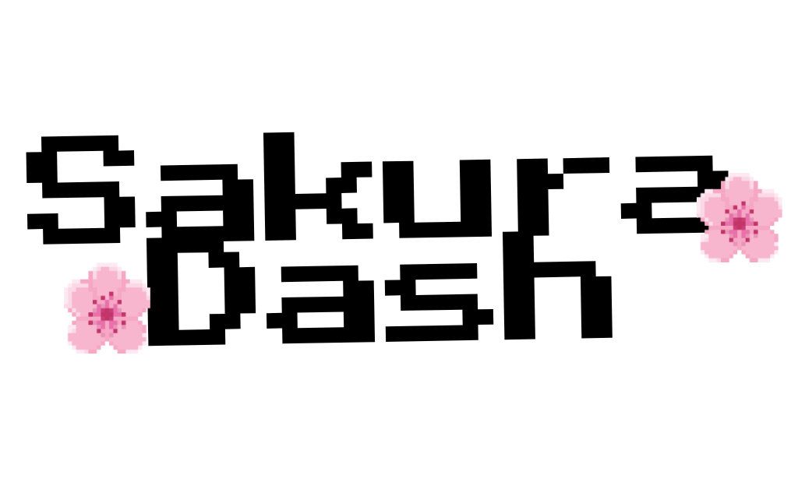
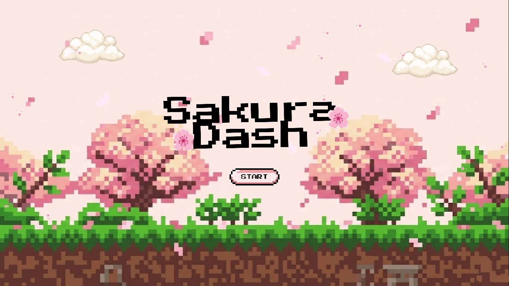
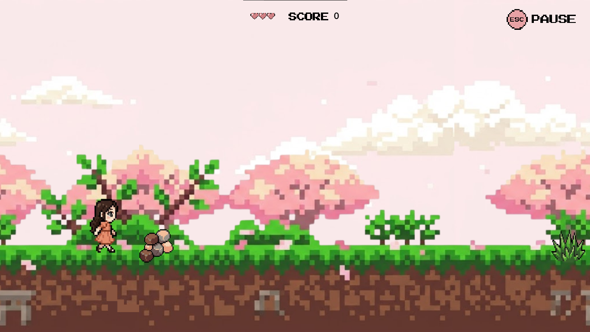
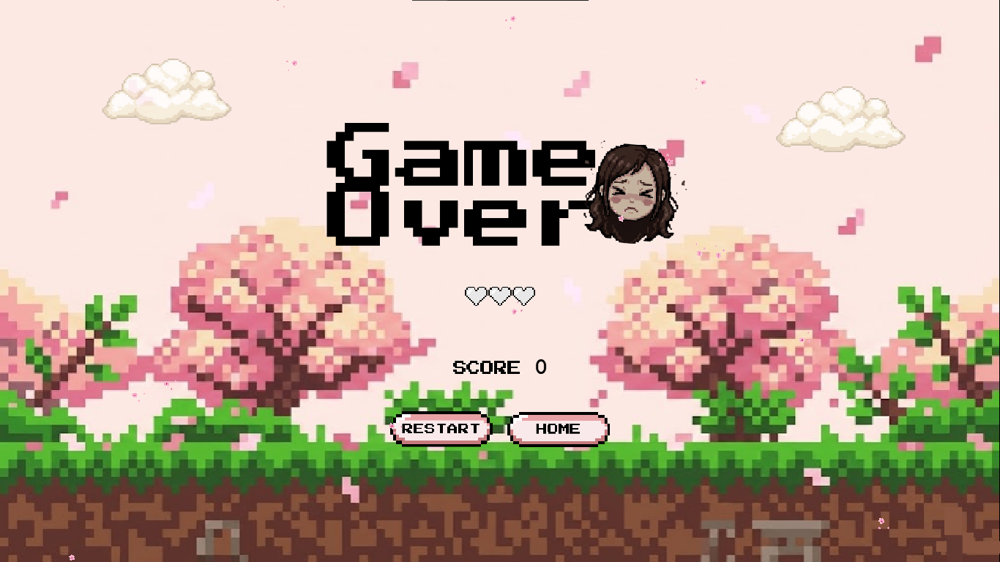
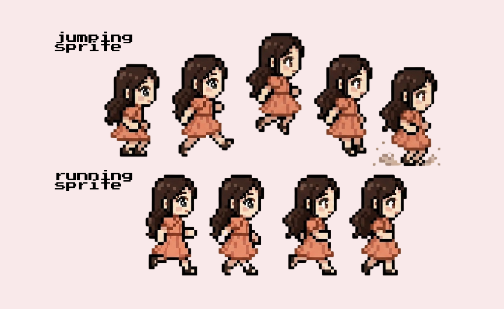

# Sakura Dash

*A side-scrolling endless runner game developed to master character animations, sprite management, and responsive gameplay logic.*

---

## 🌸 Screenshots

<table border="0" style="border: none; border-collapse: collapse;">
  <tr>
    <td align="center" style="border: none; padding: 8px;">
      
       
      🏠 Home Screen
    </td>
    <td align="center" style="border: none; padding: 8px;">
      
       
      🎮 Gameplay
    </td>
    <td align="center" style="border: none; padding: 8px;">
      
       
      💀 Game Over
    </td>
  </tr>
</table>

---

## 🛠️ Tech Stack

---

## 🌸 Sprite Sheet

 
Sakura character sprite sheet used for animations

---

## ⚙️ Key Mechanics

**🎭 Sprite Animation**
> Implementing running and jumping sprites for the character Sakura

**♾️ Endless Mechanics**
> Randomly generated obstacles and parallax scrolling backgrounds

**🕹️ Responsive Controls**
> Precise jump timing and gravity-based physics

**🎨 Asset Practice**
> A sandbox for testing custom-made game assets and UI elements

